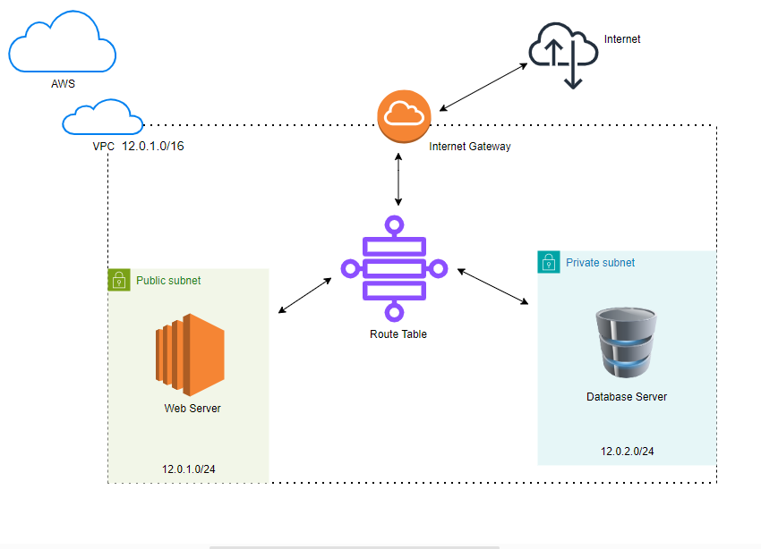

[PROJECT TITLE]: Using Terraform Module to Build a 3 Tier AWS Network VPC [AWS]

[PROJECT OBJECTIVE]: TO DEPLOY AWS RESOURCE[S] THAT INVOLVES, CREATING A VPC WITH A DEFINED CIDR ON THE AWS CLOUD PLATFORM THAT WILL HOLD AN EC2 INSTANCE ON A PUBLICSUBNET THAT WOULD SERVE AS A [WEB SERVER] TO HOST A HTML FILE [WEBSITE], AND A DATABASE SERVER IN A PRIVATE SUBNET, BOTH PUBLIC AND PRIVATE SUBNET[S] WOULD HAVE ASSOCIATIONS TO THEIR INDIVIDUAL ROUTING TABLE[S].

THE PUBLIC SUBNET'S ROUTING TABLE WILL HAVE A DEFAULT IP THAT CONNECTS TO THE INTERNET DEFINED FOR IT, BUT THE PRIVATE SUBNET'S ROUTING TABLE, HOLDING THE DATABASE SERVER WILL NOT HAVE ACCESS TO THE INTERNET.
THE ROUTING TABLE WOULD CONNECT TO AN INTERNET GATEWAY WHICH GRANTS ITS A PATHWAY TO THE INTERNET FOR THE PUBLIC SUBNET.

[METHOD]: THIS PROJECT HAS BEEN COMPLETED SUCCESSFULLY USING THE GUI OF THE AWS CONSOLE WITH THE PREDEFINED IAM ACCESS. 
HOWEVER IN THIS RESPOSITORY, WE WOULD USE TERRAFORM AS OUR TECHNOLOGY TO DEPLOY THE SAME INFRASTRUCTURE AS CODE [IAC]

[WHAT WE WOULD ACHIEVE]:

1. CREATE OUR VPC AND CONFIGURE THE CIDR IP
2. CREATE AN INTERNET GATEWAY AND ATTACH IT TO THE VPC 
3. CREATE PUBLIC AND PRIVATE SUBNET[S] OF SAME AZ AND ALSO CREATE PUBLIC AND PRIVATE ROUTING TABLE[S] 
4. FOR THE PUBLIC ROUTING TABLE, WE WOULD DEFINE A DEFAULT ROUTE 0.0.0.0/0 TO THE INTERNET THROUGH THE IGW AND CONNECT ALL TO THE SAME VPC
5. CREATE AN EC2 INSTANCE AND A SECURITY GROUP THAT WOULD ALLOW INGRESS PORT[S] 80 [HTTP] AND [22] SSH AND EGRESS OF 0.0.0.0/0
6. CONNECT THE EC2 INSTANCE TO THE CREATED VPC [ITEM 1] AND ALSO ASSOCIATE THE EC2 INSTANCE TO THE PUBLIC SUBNET
7. CREATE A RDS OF THE SAME VPC AND ASSOCIATE IT TO THE PRIVATE SUBNET
8. TEST

[TERRAFORM]: TO START WITH TERRAFORM, I DOWNLOADED AND INSTALLED THE AWS CLI ON MY WINDOWS
2. I CREATED AN IAM USER AND CREATED FOR THE USER ACCESS KEYS
3. I CONFIGURED MY TERMINAL WITH TERRAFORM USING MY IAM USER ACCESS KEYS BY RUNNING THE AWS CONFIGURE ON MY TERMINAL
THIS GRANTED ME AUTHENTICATION AND AUTHORIZATION TO USE TERRAFORM COMMANDS SUCH AS TERRFORM INIT, TERRAFORM PLAN, TERRAFORM APPLY AND TERRFORM DESTROY

YOU CAN SEE THE LINUX COMMANDS USED FOR THE OTHER PROJECT REQUIREMENTS IN THE FILE [LINUX_COMMANDS.TXT]

